# Accounting Ledger

## Table of Contents
- [Overview]()
- [Main Menu]()
- [Ledger Menu]()
- [Reports Menu]()
- [Interesting Pieces of Code]()
- [Contributors]()

## Overview

The Accounting Ledger System is a command-line Java application designed to manage transactions and ledger entries for a small business or personal finance tracking. It allows users to add deposits, make payments, view the ledger, and generate reports based on different criteria such as date range or vendor.

## Features

### Main Menu

#### The Main Menu Screen is where users are prompted to:
- Make a deposit (which is reflected as a credit to their accounts)
- Make a payment (which is reflected as a debit to their accounts)
- View their accounts ledger
- Access and manage their financial goals
- Exit the application

>

>
 Main Menu 

>
> 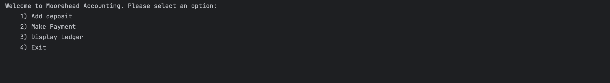
>

#### Adding a deposit

>

>
 Deposits 

>
> 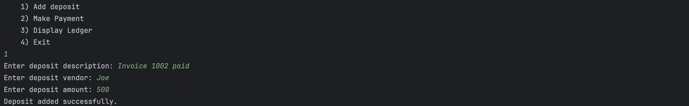
>

#### Payments

>

>
 Making a Payment 

>
>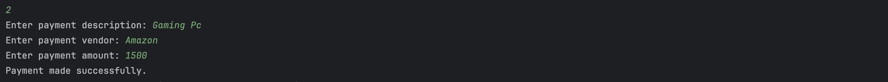
>

#### Ledger Screen

>

>
 Accessing the Ledger Screen 

>
> 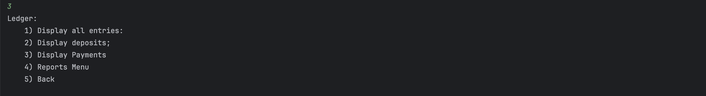
>

#### Exit Screen

>

>
 Exiting the Application 

>
> 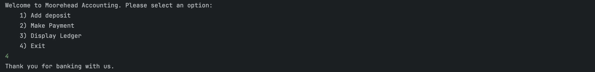
>

[Back to the Top]()

### Ledger Menu
From the Ledger Menu all transactions can be displayed or they can be sorted into deposits (+) or payments (-) or the report menu can be opened

>

>
 All Transactions 

>
> 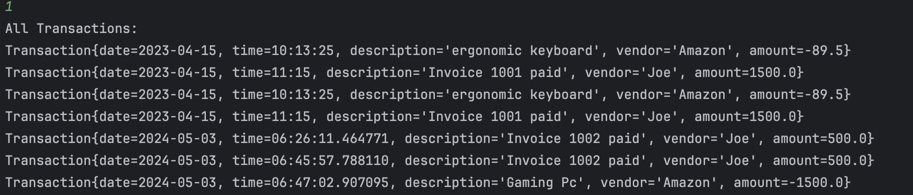
>

>

>
 Deposits 

>
> 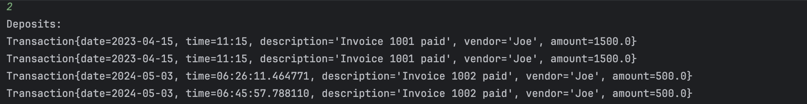
>

>

>
 Payments 

>
> 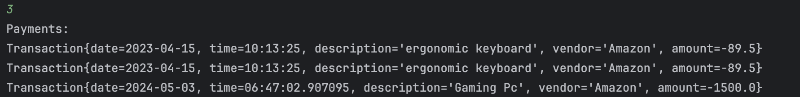
>

[Back to the Top]()

### Reports Menu
From the Reports menu you can display reports containing all transactions within a given time period or search by vendor

>

>
 Reports Menu 

>
> 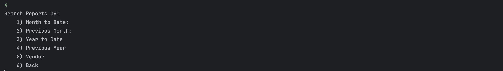
>

>

>
 Month to Date 

>
> 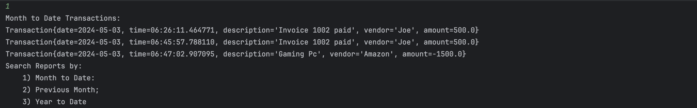
>

>

>
 Search by Vendor 

>
> 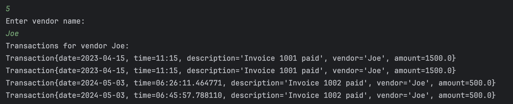
>

>

>
 Custom Search 

>
> Image here
>

[Back to the Top]()

## Interesting Pieces of Code

### Hibba's Code

One piece of code that I found interesting was within the makePayment method. This piece of code checks to see if the user inputs the correct data type. If they do, the program continues, but if they not, instead of the program crashing, they are asked to try again.

>

>
 Make Payment Code 

>
> 

>

### Marshall's Code

### Tristan's Code
One piece of code I found interesting was for my menus. Instead of using nest do while loops with switches I created methods containing the submenus to keep the code more concise and readable.

>

>
 Main Menu Code 

>
> 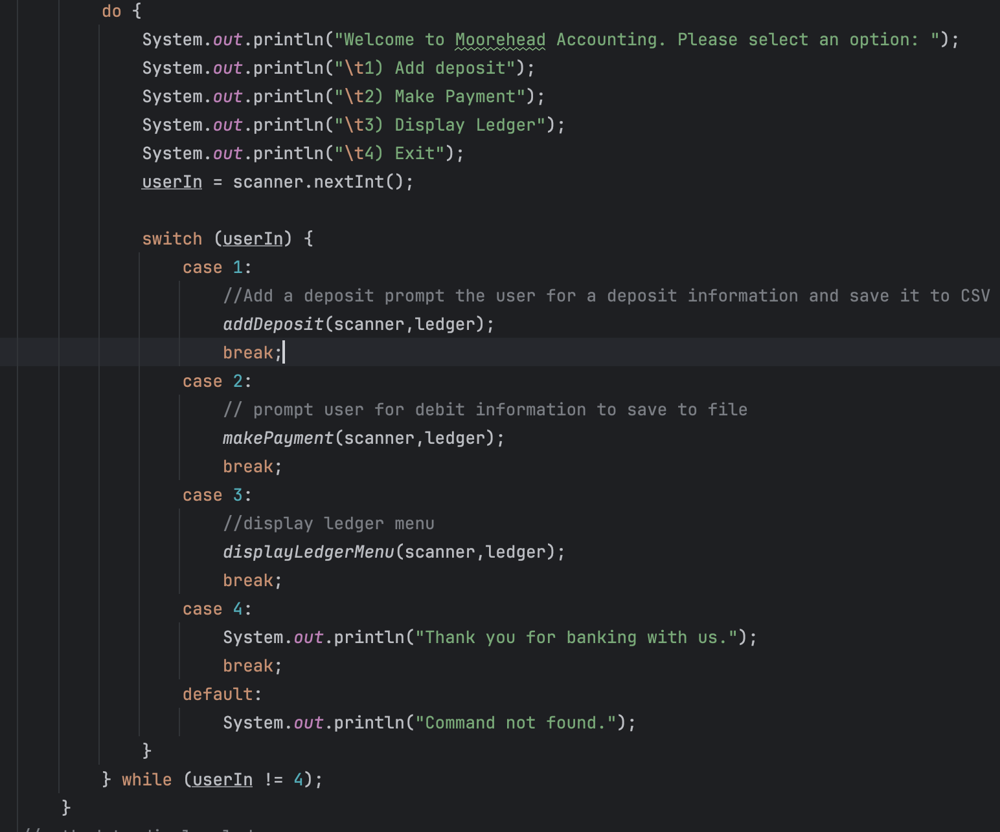
>

>

>
 Ledger Menu Code 

>
> 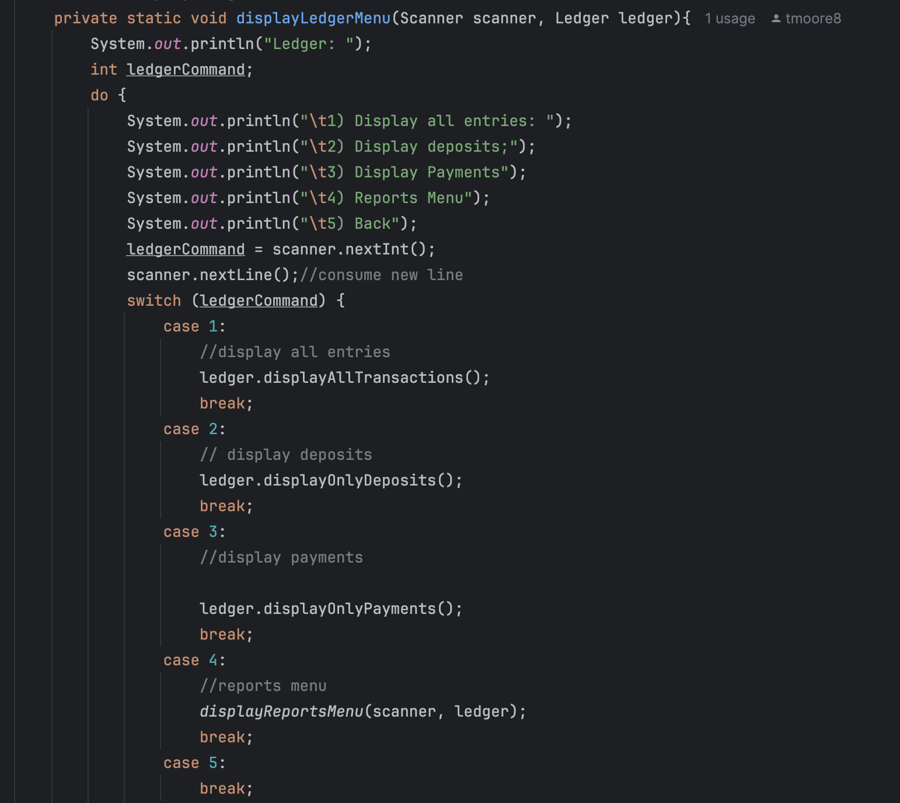
>

>

>
 Reports Menu Code 

>
> 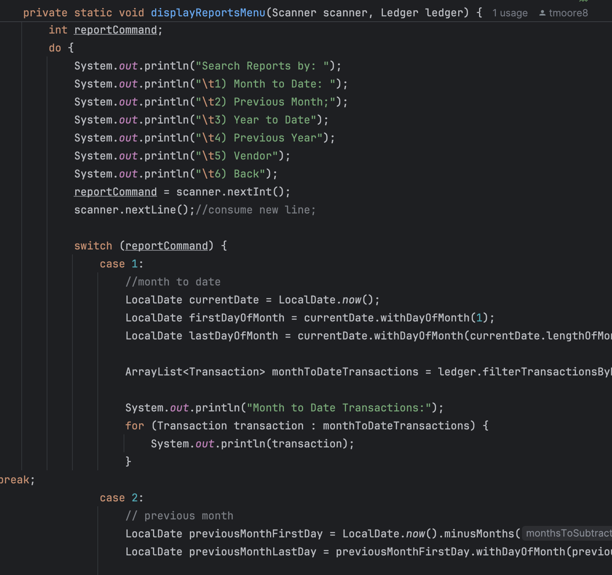
>

### Alisha's Interesting Piece of Code

If I had to pick a piece of code that I found interesting, I would definitely have to pick where I wrote a  helper method 
which helped me display all the transactions throughout the application without needing to format and print out every time 
I need to show the user their requested transactions.

>

>
 Displaying Transactions Helper Method 

>
> Image here
>

[Back to the Top]()

## Contributors

### Hibba Afzal

- [Hibba's Github](https://github.com/hibbaafzal)

### Marshall Ellis-Gibbs

- [Marshall's Github](https://github.com/MarshallE-G)

### Tristan Moorehead 

- [Tristan's Github](https://github.com/tmoore8)

### Alisha Yu

- [Alisha's Github](https://github.com/alyu15)

[Back to the Top]()

