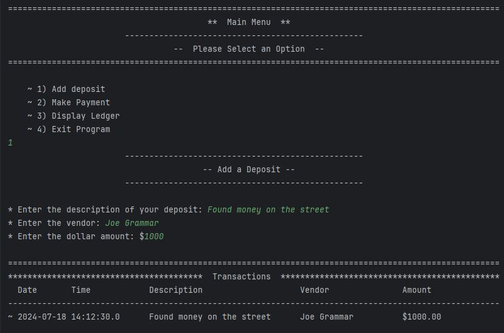
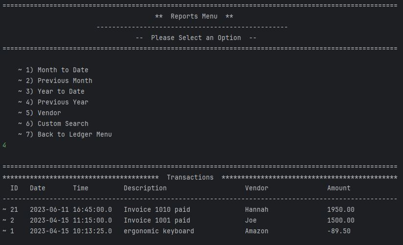

# Accounting Ledger

## Table of Contents
- [Overview](https://github.com/tmoore8/AccountingLedgerVersion2.0?tab=readme-ov-file#overview)
- [Main Menu](https://github.com/tmoore8/AccountingLedgerVersion2.0?tab=readme-ov-file#main-menu)
- [Ledger Menu](https://github.com/tmoore8/AccountingLedgerVersion2.0?tab=readme-ov-file#ledger-menu)
- [Reports Menu](https://github.com/tmoore8/AccountingLedgerVersion2.0?tab=readme-ov-file#reports-menu)
- [Interesting Pieces of Code](https://github.com/tmoore8/AccountingLedgerVersion2.0?tab=readme-ov-file#interesting-pieces-of-code)
- [Contributors](https://github.com/tmoore8/AccountingLedgerVersion2.0?tab=readme-ov-file#contributors)

## Overview

The Accounting Ledger System is a command-line Java application designed to manage transactions and ledger entries for a small business or personal finance tracking. It allows users to add deposits, make payments, view the ledger, and generate reports based on different criteria such as date range or vendor.

## Features

### Main Menu

#### The Main Menu Screen is where users are prompted to:
- Make a deposit (which is reflected as a credit to their accounts)
- Make a payment (which is reflected as a debit to their accounts)
- View their accounts ledger
- Exit the application

>

>
 Main Menu 

>
> 
>

#### Adding a deposit

>

>
 Adding a Deposit 

>
> 
>

#### Payments

>

>
 Making a Payment 

>
> 
>

#### Ledger Screen

>

>
 Accessing the Ledger Screen 

>
> 
>

#### Exit Screen

>

>
 Exiting the Application 

>
> 
>

[Back to the Top]()

### Ledger Menu
#### The Ledger Screen is where users are able to:
- View all the transactions on their account
- View all deposits made on their account
- View all their payments made on their account

>

>
 All Transactions 

>
> 
>

>

>
 All Deposits 

>
> 
>

>

>
 All Payments 

>
> 
>

[Back to the Top](https://github.com/tmoore8/AccountingLedgerVersion2.0?tab=readme-ov-file#table-of-contents)

### Reports Menu
#### The Reports Screen allows the user to either execute pre-defined reports or conduct a customized search.
#### These pre-defined reports enable the user to explore their transactions by:
- Month to Date
- Previous Month
- Year to Date
- Previous Year
#### The user is also able to:
- Search by vendor
- Perform a custom search
#### All these reports display both the user's deposits and payments.
>

>
 Reports Menu 

>
> 
>

>

>
 Month to Date 

>
> 
>

>

>
 Previous Month 

>
> 
>

>

>
 Year to Date 

>
> 
>

>

>
 Previous Year 

>
> 
>

>

>
 Search by Vendor 

>
> 
>

>

>
 Custom Search 

>
> 
>

[Back to the Top](https://github.com/tmoore8/AccountingLedgerVersion2.0?tab=readme-ov-file#table-of-contents)

## Interesting Pieces of Code

### Hibba's Code

One piece of code that I found interesting was within the makePayment method. This piece of code checks to see if the user inputs the correct data type. If they do, the program continues, but if they not, instead of the program crashing, they are asked to try again.

>

>
 Make Payment Code 

>
> 
>
>

### Marshall's Code

>

>
 Empty Input for Custom Search Amount Code 

>
> 
>

### Tristan's Code

>

>
 Interesting Code 

>
> Image here
>

### Alisha's Interesting Piece of Code

If I had to pick a piece of code that I found interesting, I would definitely have to pick where I wrote a  helper method 
which helped me display all the transactions throughout the application without needing to format and print out every time 
I need to show the user their requested transactions.

>

>
 Display Transactions Helper Method 

>
> 
>

[Back to the Top](https://github.com/tmoore8/AccountingLedgerVersion2.0?tab=readme-ov-file#table-of-contents)

## Contributors

### Hibba Afzal

- [Hibba's Github](https://github.com/hibbaafzal)

### Marshall Ellis-Gibbs

- [Marshall's Github](https://github.com/MarshallE-G)

### Tristan Moorehead 

- [Tristan's Github](https://github.com/tmoore8)

### Alisha Yu

- [Alisha's Github](https://github.com/alyu15)

[Back to the Top](https://github.com/tmoore8/AccountingLedgerVersion2.0?tab=readme-ov-file#table-of-contents)